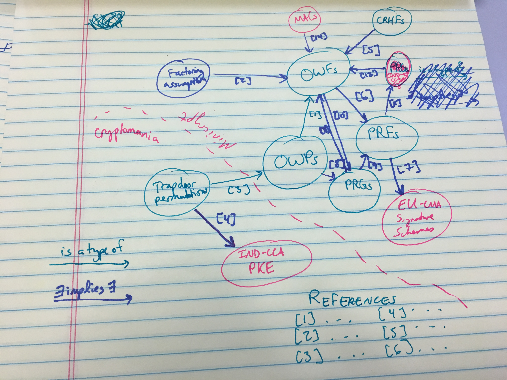

# Map of Crypto

### What's a map of crypto?
* A project I hope to build (with your help!) over the next few months.
* A "map" (DAG) of crypto primitives, and the relationships between them!
  Haven't you ever been sitting around thinking, "darn it, where's the
  reference saying that OWFs imply PRFs, I want to check something."
* Publicly accessible on the Internet so it's easy to check!
* Easy to contribute to, as much or as little as you want to!
* Eventually, will have a nice interface that lets you explore relationships
  between these various objects, and the objects themselves.

### It will look something like this, hopefully.

### Contributions
* **To verify a previously-submitted node or edge:**
    * If there are existing pull requests marked with `unverified`, follow up
      on the information there.
    * If the information is incorrect, inform the author of the pull request in
      a comment on the request.
    * If the information is correct, add your name to the `verifier` field of
      the objects, or tell the requester to do so.
    * You can then merge in the pull request or tell the submitter that it is
      ready for merging.
* **To submit a new node or edge (see suggested_new_objects.md for suggestions):**
    * Make a new branch
    * Create a new file for the node or edge in the `objects` folder.
      (Notice that there are currently only two types of edges: "is a type of"
      and "∃ X implies ∃ Y").  Follow the schema listed in `schema.json` or use
      existing files as a template.
    * Commit your work and push it to your branch.  (Feel free to set the
      `submitter` field to your name or username.)
    * Create a pull request to `master`.  Make sure you add the `unverified`
      tag, since all new contributions require at least two sets of eyes before
      they're merged in.
    * When you have verification, merge your pull request if your verifier did
      not do so.
    * You can then delete your branch if you want.
* **To propose a modification to the schema:**
    * Make a new branch
    * Modify the schema as you think it should be modified
    * Create a PR and assign `sarahscheffler` (or, in the future, others)
* **To help with the display of the graph, or a wiki-style perusal of the
  graph:**
    * Email sscheff@bu.edu because I'm currently looking for someone that knows
      anything about d3 or wiki setup to make the front-end of this.
* **Anything else:**
    * Create an issue, leave a comment, or make a PR as appropriate.

### What this map is and what it isn't
* **What it is:** A helpful crypto reference. 
    * If you know what you're looking for, it should be a helpful way to 
      double-check it.
    * You should be able to trace everything back to the assumptions used.
* **What it is not:** A textbook.
    * If you don't know what you're looking for, it won't give
      you a full description of it (though it may link you to one).
    * Another consequence of the "not a textbook" property is that it won't 
      have everything.  Since it's not a textbook, it doesn't have to talk
      about, for instance, "encrypt-then-mac".

### Future goals:
* Clicking on an object should give you either links to constructions, or a
  brief description of the construction itself
* Show (current or provably best) blowup. Whenver possible, include this info
  in links between objects.

